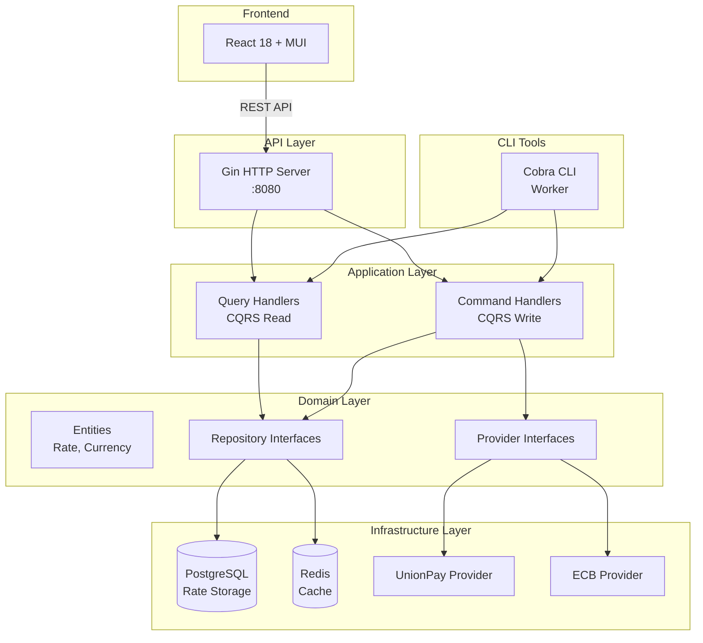
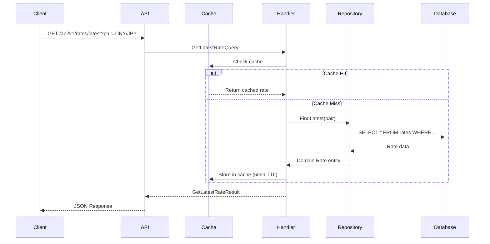

# RateFlow

[English](#english) | [中文](#中文)

---

## English


> A modern, scalable multi-currency exchange rate tracking platform built with Go 1.25+ and React 18+

[](https://go.dev/)
[](https://react.dev/)
[](LICENSE)


---

## ✨ Features

### Backend
- 🚀 **Modern Go**: Leverages Go 1.25+ features (generics, range over func, slog)
- 🎯 **Domain-Driven Design**: Clean architecture with clear separation of concerns
- 📊 **Multi-Currency Support**: Extensible provider system for various data sources
- ⚡ **High Performance**: Redis caching + streaming queries for efficiency
- 🐳 **Container-Ready**: Docker and Kubernetes deployment configs included
- 🔧 **Developer-Friendly**: Comprehensive CLI tools with Cobra

### Frontend
- 🎨 **Modern React 18**: Built with TypeScript and Material-UI v5
- 🌍 **Internationalization**: Full i18n support (English/Chinese)
- 🌓 **Dark Mode**: Persistent theme switching with localStorage
- 📈 **Rich Visualizations**:
  - 7-day mini sparkline charts with trend indicators
  - Interactive rate charts with smart Y-axis scaling
  - Custom date range selector (1-365 days)
  - Real-time data updates
- 💱 **Currency Tools**:
  - Dual-dropdown currency pair selector with swap button
  - Real-time currency converter
  - 30-day statistics (high/low/average/change)
- 📤 **Data Export**: Export historical data as CSV or JSON
- 📱 **Responsive Design**: Optimized for desktop, tablet, and mobile

---

## 🏗️ Architecture

### System Architecture



### Data Flow



### Project Structure

```
rateflow/
├── cmd/                          # Entry points
│   ├── api/                      # API server
│   └── worker/                   # CLI tools
├── internal/                     # Private application code
│   ├── domain/                   # Domain layer (business logic)
│   │   ├── currency/             # Currency value objects
│   │   ├── rate/                 # Rate aggregate root
│   │   └── provider/             # Provider interfaces
│   ├── application/              # Application layer (use cases)
│   │   ├── query/                # Query handlers (CQRS read)
│   │   ├── command/              # Command handlers (CQRS write)
│   │   └── dto/                  # Data transfer objects
│   ├── infrastructure/           # Infrastructure layer
│   │   ├── config/               # Configuration
│   │   ├── logger/               # Structured logging (slog)
│   │   ├── persistence/          # Data persistence
│   │   │   ├── postgres/         # PostgreSQL implementation
│   │   │   └── redis/            # Redis cache implementation
│   │   └── provider/             # External data sources
│   │       └── unionpay/         # UnionPay API client
│   └── presentation/             # Presentation layer
│       ├── http/                 # HTTP handlers & middleware
│       └── cli/                  # CLI commands
├── pkg/                          # Public reusable packages
│   ├── result/                   # Result type (error handling)
│   ├── option/                   # Option type (nullable values)
│   ├── stream/                   # Stream utilities (range over func)
│   ├── genericrepo/              # Generic repository pattern
│   ├── httputil/                 # HTTP client utilities
│   └── timeutil/                 # Time utilities
├── web/                          # React frontend
│   ├── src/
│   │   ├── features/             # Feature modules
│   │   ├── api/                  # API client
│   │   └── shared/               # Shared components
│   └── package.json
├── deploy/                       # Deployment configurations
│   ├── docker/                   # Dockerfiles
│   └── k8s/                      # Kubernetes manifests
└── docs/                         # Documentation
```

---

## 🚀 Quick Start

### Prerequisites

- Go 1.25+
- Node.js 20+
- Docker & Docker Compose
- PostgreSQL 16+ (or use Docker)
- Redis 7+ (or use Docker)

### Local Development

1. **Clone the repository**

```bash
git clone https://github.com/tyokyo320/rateflow.git
cd rateflow
```

2. **Start dependencies**

```bash
docker-compose up -d postgres redis
```

3. **Configure environment**

```bash
cp .env.example .env
# Edit .env with your settings
```

4. **Run API server**

```bash
go run cmd/api/main.go
```

5. **Run worker to fetch rates**

```bash
go run cmd/worker/main.go fetch --pair CNY/JPY
```

6. **Test the API**

```bash
# Health check
curl http://localhost:8080/health

# Get latest rate
curl http://localhost:8080/api/v1/rates/latest?pair=CNY/JPY
```

### Docker Deployment

```bash
# Build images
docker build -f deploy/docker/api.Dockerfile -t rateflow-api .
docker build -f deploy/docker/worker.Dockerfile -t rateflow-worker .

# Run with docker-compose
docker-compose up -d

# View logs
docker-compose logs -f api
```

### Frontend Development

```bash
cd web
npm install
npm run dev
```

Visit `http://localhost:5173` to see the dashboard.

**Frontend Features:**
- 📊 Real-time exchange rate monitoring
- 📈 Interactive charts with 7/14/30/60/90 day views + custom range
- 💱 Currency converter with bidirectional conversion
- 🌓 Dark/Light theme toggle
- 🌍 Language switcher (EN/中文)
- 📤 Export data as CSV or JSON
- 📱 Fully responsive design

---

## 📖 API Documentation

### Endpoints

#### Health Check

```http
GET /health
```

**Response:**
```json
{
  "status": "ok"
}
```

#### Get Latest Rate

```http
GET /api/v1/rates/latest?pair=CNY/JPY
```

**Response:**
```json
{
  "success": true,
  "data": {
    "pair": "CNY/JPY",
    "rate": 0.061234,
    "effectiveDate": "2025-11-02T00:00:00Z",
    "source": "unionpay"
  },
  "timestamp": "2025-11-02T10:30:00Z"
}
```

#### Get Rate History

```http
GET /api/v1/rates/history?pair=CNY/JPY&days=7
```

**Response:**
```json
{
  "success": true,
  "data": {
    "items": [
      {
        "pair": "CNY/JPY",
        "rate": 0.061234,
        "effectiveDate": "2025-11-02T00:00:00Z",
        "source": "unionpay"
      }
    ],
    "pagination": {
      "page": 1,
      "pageSize": 7,
      "total": 100,
      "totalPages": 15
    }
  }
}
```

---

## 🔧 CLI Usage

### Fetch Rates

```bash
# Fetch today's rate for CNY/JPY
./rateflow-worker fetch --pair CNY/JPY

# Fetch historical rate
./rateflow-worker fetch --pair CNY/JPY --date 2025-11-01

# Fetch multiple pairs
./rateflow-worker fetch --pair USD/JPY
./rateflow-worker fetch --pair EUR/JPY
```

### Consolidate Data

```bash
# Consolidate temporary rates into main table
./rateflow-worker consolidate
```

### Database Migration

```bash
# Run migrations
./rateflow-worker migrate up

# Rollback
./rateflow-worker migrate down
```

### Database Initialization

The database schema is automatically migrated using GORM AutoMigrate when the API server starts. However, you need to populate initial rate data.

#### For Docker Users

```bash
# 1. Start the services
docker-compose up -d

# 2. The database will be auto-migrated on first API start

# 3. Fetch initial rate data
docker-compose exec api ./rateflow-worker fetch --pair CNY/JPY

# Or use docker run
docker run --rm --network rateflow_default \
  -e DB_HOST=postgres \
  -e DB_PORT=5432 \
  -e DB_USER=rateflow \
  -e DB_PASSWORD=rateflow_password \
  -e DB_NAME=rateflow \
  -e DB_SSLMODE=disable \
  tyokyo320/rateflow-worker:latest \
  fetch --pair CNY/JPY
```

#### For Kubernetes Users

```bash
# 1. Deploy the application
kubectl apply -k deploy/k8s

# 2. Wait for pods to be ready
kubectl wait --for=condition=ready pod -l app=rateflow-api -n rateflow --timeout=60s

# 3. Initialize rate data
kubectl run -it --rm rateflow-init \
  --image=tyokyo320/rateflow-worker:latest \
  --restart=Never \
  --namespace=rateflow \
  --env="DB_HOST=postgres" \
  --env="DB_PORT=5432" \
  --env="DB_USER=rateflow" \
  --env="DB_NAME=rateflow" \
  --env="DB_PASSWORD=your_password" \
  --env="DB_SSLMODE=disable" \
  -- fetch --pair CNY/JPY

# The CronJob will automatically fetch new rates hourly
```

#### For Local Development (without Docker)

```bash
# 1. Make sure PostgreSQL and Redis are running
# PostgreSQL 17 on localhost:5432
# Redis 8 on localhost:6379

# 2. Set environment variables
export DB_HOST=localhost
export DB_PORT=5432
export DB_USER=rateflow
export DB_PASSWORD=your_password
export DB_NAME=rateflow
export DB_SSLMODE=disable
export REDIS_HOST=localhost
export REDIS_PORT=6379
export LOG_LEVEL=debug

# 3. Run the API (auto-migrates database)
go run cmd/api/main.go

# 4. In another terminal, fetch initial data
go run cmd/worker/main.go fetch --pair CNY/JPY

# 5. Fetch historical data (optional)
go run cmd/worker/main.go fetch --pair CNY/JPY --start 2024-01-01 --end 2024-12-31
```

#### Verify Database

```bash
# Docker
docker-compose exec postgres psql -U rateflow -d rateflow -c "SELECT COUNT(*) FROM rates;"

# Kubernetes
kubectl exec -it -n rateflow statefulset/postgres -- psql -U rateflow -d rateflow -c "SELECT COUNT(*) FROM rates;"

# Local
psql -h localhost -U rateflow -d rateflow -c "SELECT COUNT(*) FROM rates;"
```

---

## 🎯 Core Concepts

### 1. Generics (Go 1.25+)

```go
// Generic repository for any entity type
type Repository[T Entity] interface {
    Create(ctx context.Context, entity T) error
    FindByID(ctx context.Context, id string) (T, error)
    Stream(ctx context.Context) iter.Seq[T] // Go 1.23 range over func
}
```

### 2. Range Over Function

```go
// Memory-efficient streaming of large datasets
for rate := range rateRepo.Stream(ctx) {
    process(rate)
    // Early termination supported
    if someCondition {
        break
    }
}
```

### 3. Result Pattern

```go
// Elegant error handling without exceptions
result := GetLatestRate(ctx, pair)

// Chain operations
finalResult := result.
    Map(func(r Rate) Rate { return r.WithDiscount() }).
    UnwrapOr(defaultRate)
```

### 4. Domain-Driven Design

```go
// Value Object - Currency Pair
pair, _ := currency.NewPair(currency.CNY, currency.JPY)

// Aggregate Root - Rate Entity
rate, _ := rate.NewRate(pair, 0.061234, time.Now(), rate.SourceUnionPay)

// Domain validation
if err := rate.Validate(); err != nil {
    // Handle validation error
}
```

### 5. CQRS Pattern

```go
// Query (Read) - Optimized for reading
type GetLatestRateQuery struct {
    Pair currency.Pair
}

// Command (Write) - Optimized for writing
type FetchRateCommand struct {
    Pair currency.Pair
    Date time.Time
}
```

---

## 🧪 Testing

```bash
# Run all tests
go test ./...

# Run with coverage
go test -cover ./...

# Run specific package
go test ./internal/domain/rate/...

# Run with race detector
go test -race ./...
```

---

## 📊 Performance

- **API Response Time**: < 50ms (with cache)
- **Cache Hit Rate**: > 90% for latest rates
- **Throughput**: > 1000 req/s (single instance)
- **Database Connection Pool**: 25 connections
- **Memory Usage**: ~50MB (idle), ~200MB (peak)

---

## 🛠️ Configuration

### Environment Variables

```bash
# Server
SERVER_HOST=0.0.0.0
SERVER_PORT=8080
ENVIRONMENT=production

# Database
DB_HOST=postgres
DB_PORT=5432
DB_USER=rateflow
DB_PASSWORD=your_secure_password
DB_NAME=rateflow
DB_SSLMODE=require
DB_MAX_CONNS=25

# Redis
REDIS_HOST=redis
REDIS_PORT=6379
REDIS_PASSWORD=your_redis_password
REDIS_DB=0

# Logging
LOG_LEVEL=info        # debug, info, warn, error
LOG_FORMAT=json       # json, text

# Config File (optional)
CONFIG_PATH=./config.json
```

### Config File

See [config.json.example](config.json.example) for a complete configuration file template.

---

## 🚢 Deployment

### Docker Compose

```bash
docker-compose up -d
```

### Kubernetes

```bash
# Apply manifests
kubectl apply -f deploy/k8s/

# Check status
kubectl get pods -l app=rateflow

# View logs
kubectl logs -f deployment/rateflow-api
```

### CronJob (Scheduled Tasks)

```yaml
# Fetch rates hourly
apiVersion: batch/v1
kind: CronJob
metadata:
  name: rateflow-fetch
spec:
  schedule: "0 * * * *"
  jobTemplate:
    spec:
      template:
        spec:
          containers:
          - name: worker
            image: rateflow-worker:latest
            args: ["fetch", "--pair", "CNY/JPY"]
```

---

## 🤝 Contributing

Contributions are welcome! Please follow our development workflow:

### Branch Strategy

- `master` - Production-ready code, protected branch
- `develop` - Development branch for integration

### Development Workflow

1. **Fork the repository**

2. **Clone and create feature branch from develop**
   ```bash
   git clone https://github.com/yourusername/rateflow.git
   cd rateflow
   git checkout develop
   git checkout -b feature/amazing-feature
   ```

3. **Make your changes**
   - Write code following the project conventions
   - Add tests for new features
   - Update documentation as needed

4. **Commit your changes**
   ```bash
   git add .
   git commit -m 'feat: add amazing feature'
   ```

   Follow [Conventional Commits](https://www.conventionalcommits.org/):
   - `feat:` - New feature
   - `fix:` - Bug fix
   - `docs:` - Documentation changes
   - `refactor:` - Code refactoring
   - `test:` - Adding tests
   - `chore:` - Maintenance tasks

5. **Push to your fork**
   ```bash
   git push origin feature/amazing-feature
   ```

6. **Create Pull Request**
   - Target the `develop` branch
   - Fill in the PR template
   - Wait for CI checks to pass
   - Request review from maintainers

7. **After PR is approved**
   - Maintainers will merge to `develop`
   - Periodically, `develop` will be merged to `master`

### Release Process

Releases are created from the `master` branch:

1. **Create a release tag**
   ```bash
   git checkout master
   git tag -a v1.0.0 -m "Release v1.0.0"
   git push origin v1.0.0
   ```

2. **Automated release workflow**
   - GitHub Actions automatically builds binaries
   - Docker images are built and pushed (multi-arch: amd64/arm64)
   - GitHub Release is created with changelog
   - Images tagged as `v1.0.0` and `latest`

3. **Available artifacts**
   - Docker images: `tyokyo320/rateflow-api:v1.0.0`, `tyokyo320/rateflow-worker:v1.0.0`
   - Linux binaries: `rateflow-api-linux-amd64`, `rateflow-worker-linux-amd64`
   - Checksums for verification

---

## 📝 License

This project is licensed under the MIT License - see the [LICENSE](LICENSE) file for details.

---

## 🙏 Acknowledgments

- [Gin](https://github.com/gin-gonic/gin) - HTTP framework
- [GORM](https://gorm.io/) - ORM library
- [Cobra](https://github.com/spf13/cobra) - CLI framework
- [Material-UI](https://mui.com/) - React UI framework
- UnionPay International for providing exchange rate data

---

## 📧 Contact

- **Author**: tyokyo320
- **Website**: https://rate.tyokyo320.com
- **GitHub**: [@tyokyo320](https://github.com/tyokyo320)

---

<div align="center">

**Made with ❤️ using Go 1.25+ and React 18+**

[Report Bug](https://github.com/tyokyo320/rateflow/issues) · [Request Feature](https://github.com/tyokyo320/rateflow/issues)

</div>

---

## 中文


> 使用 Go 1.25+ 和 React 18+ 构建的现代化多货币汇率追踪平台


---

## ✨ 特性

- 🚀 **现代 Go**: 充分利用 Go 1.25+ 新特性（泛型、range over func、slog）
- 🎯 **领域驱动设计**: 清晰的架构分层
- 📊 **多货币支持**: 可扩展的数据源提供商系统
- ⚡ **高性能**: Redis 缓存 + 流式查询
- 🎨 **现代前端**: React 18 + Material-UI + TypeScript
- 🐳 **容器化**: 包含 Docker 和 Kubernetes 部署配置
- 🔧 **开发友好**: 使用 Cobra 的完整 CLI 工具

---

## 🏗️ 架构

### 系统架构

```
Frontend (React 18 + MUI)
         ↓
API Layer (Gin HTTP Server)
         ↓
Application Layer (CQRS)
    ↙          ↘
Query        Command
         ↓
Domain Layer (DDD)
    ↙     ↓      ↘
Entity  Repo  Provider
         ↓
Infrastructure Layer
    ↙     ↓      ↘
PostgreSQL Redis UnionPay
```

### 项目结构

```
rateflow/
├── cmd/                    # 入口程序
│   ├── api/               # API 服务
│   └── worker/            # CLI 工具
├── internal/              # 私有应用代码
│   ├── domain/           # 领域层（业务核心）
│   ├── application/      # 应用层（用例）
│   ├── infrastructure/   # 基础设施层
│   └── presentation/     # 表现层
├── pkg/                   # 公共可复用包
│   ├── result/           # Result 模式
│   ├── option/           # Option 模式
│   ├── stream/           # 流式处理
│   ├── genericrepo/      # 泛型仓储
│   └── ...
├── web/                   # React 前端
└── deploy/                # 部署配置
```

---

## 🚀 快速开始

### 前置要求

- Go 1.25+
- Node.js 20+
- Docker & Docker Compose
- PostgreSQL 17+
- Redis 8+

### 本地开发

1. **克隆仓库**

```bash
git clone https://github.com/tyokyo320/rateflow.git
cd rateflow
```

2. **启动依赖服务**

```bash
make db-up
```

3. **配置环境**

```bash
cp .env.example .env
# 编辑 .env 文件
```

4. **运行 API 服务**

```bash
make run-api
```

5. **测试 API**

```bash
# 健康检查
curl http://localhost:8080/health

# 获取最新汇率
curl http://localhost:8080/api/v1/rates/latest?pair=CNY/JPY
```

---


### 数据库初始化

数据库表结构会在 API 服务器启动时通过 GORM AutoMigrate 自动创建。但你需要手动获取初始汇率数据。

#### Docker 用户

```bash
# 1. 启动服务
docker-compose up -d

# 2. 数据库会在 API 首次启动时自动迁移

# 3. 获取初始汇率数据
docker-compose exec api ./rateflow-worker fetch --pair CNY/JPY

# 或者使用 docker run
docker run --rm --network rateflow_default \
  -e DB_HOST=postgres \
  -e DB_PORT=5432 \
  -e DB_USER=rateflow \
  -e DB_PASSWORD=rateflow_password \
  -e DB_NAME=rateflow \
  -e DB_SSLMODE=disable \
  tyokyo320/rateflow-worker:latest \
  fetch --pair CNY/JPY
```

#### Kubernetes 用户

```bash
# 1. 部署应用
kubectl apply -k deploy/k8s

# 2. 等待 Pod 就绪
kubectl wait --for=condition=ready pod -l app=rateflow-api -n rateflow --timeout=60s

# 3. 初始化汇率数据
kubectl run -it --rm rateflow-init \
  --image=tyokyo320/rateflow-worker:latest \
  --restart=Never \
  --namespace=rateflow \
  --env="DB_HOST=postgres" \
  --env="DB_PORT=5432" \
  --env="DB_USER=rateflow" \
  --env="DB_NAME=rateflow" \
  --env="DB_PASSWORD=your_password" \
  --env="DB_SSLMODE=disable" \
  -- fetch --pair CNY/JPY

# CronJob 会每小时自动获取新汇率
```

#### 本地开发（不使用 Docker）

```bash
# 1. 确保 PostgreSQL 和 Redis 正在运行
# PostgreSQL 17 在 localhost:5432
# Redis 8 在 localhost:6379

# 2. 设置环境变量
export DB_HOST=localhost
export DB_PORT=5432
export DB_USER=rateflow
export DB_PASSWORD=your_password
export DB_NAME=rateflow
export DB_SSLMODE=disable
export REDIS_HOST=localhost
export REDIS_PORT=6379
export LOG_LEVEL=debug

# 3. 运行 API（自动迁移数据库）
go run cmd/api/main.go

# 4. 在另一个终端获取初始数据
go run cmd/worker/main.go fetch --pair CNY/JPY

# 5. 获取历史数据（可选）
go run cmd/worker/main.go fetch --pair CNY/JPY --start 2024-01-01 --end 2024-12-31
```

#### 验证数据库

```bash
# Docker
docker-compose exec postgres psql -U rateflow -d rateflow -c "SELECT COUNT(*) FROM rates;"

# Kubernetes
kubectl exec -it -n rateflow statefulset/postgres -- psql -U rateflow -d rateflow -c "SELECT COUNT(*) FROM rates;"

# 本地
psql -h localhost -U rateflow -d rateflow -c "SELECT COUNT(*) FROM rates;"
```

---

## 📖 核心概念

### 1. Go 1.23 新特性

#### Range Over Function（流式处理）
```go
// 内存高效的大数据集处理
for rate := range rateRepo.Stream(ctx) {
    process(rate)
}
```

#### 泛型
```go
// 通用仓储，支持任何实体类型
type Repository[T Entity] interface {
    Create(ctx context.Context, entity T) error
    FindByID(ctx context.Context, id string) (T, error)
    Stream(ctx context.Context) iter.Seq[T]
}
```

#### 结构化日志（slog）
```go
slog.Info("rate fetched",
    "pair", "CNY/JPY",
    "rate", 0.061234,
    slog.Group("metadata",
        "source", "unionpay",
    ),
)
```

### 2. Result 模式

```go
// 优雅的错误处理
result := GetLatestRate(ctx, pair)

finalResult := result.
    Map(func(r Rate) Rate { return r.WithDiscount() }).
    UnwrapOr(defaultRate)
```

### 3. 领域驱动设计

```go
// 值对象
pair, _ := currency.NewPair(currency.CNY, currency.JPY)

// 聚合根
rate, _ := rate.NewRate(pair, 0.061234, time.Now(), rate.SourceUnionPay)

// 领域验证
if err := rate.Validate(); err != nil {
    // 处理验证错误
}
```

---

## 🛠️ 开发命令

```bash
# 构建
make build

# 运行测试
make test

# 代码检查
make lint

# 格式化代码
make fmt

# 启动开发环境
make dev

# Docker 构建
make docker-build

# 启动所有服务
make docker-up
```

---

## 📚 文档

- [实施指南](IMPLEMENTATION_GUIDE.md) - 完整的实现步骤和示例代码
- [重构方案](REFACTOR_PLAN.md) - 详细的技术设计和架构决策
- [项目摘要](PROJECT_SUMMARY.md) - 当前进度和技术亮点
- [API 文档](README.md#api-documentation) - REST API 详细说明

---

## 🎯 技术栈

### 后端
- **语言**: Go 1.23
- **Web 框架**: Gin
- **ORM**: GORM
- **缓存**: Redis
- **CLI**: Cobra
- **日志**: slog (官方)
- **依赖注入**: Wire

### 前端
- **框架**: React 18
- **UI 库**: Material-UI (MUI)
- **状态管理**: TanStack Query + Zustand
- **构建工具**: Vite
- **语言**: TypeScript

### 基础设施
- **数据库**: PostgreSQL 17
- **缓存**: Redis 8
- **容器**: Docker
- **编排**: Kubernetes
- **CI/CD**: GitHub Actions

---

## 📊 性能指标

- **API 响应时间**: < 50ms（使用缓存）
- **缓存命中率**: > 90%（最新汇率）
- **吞吐量**: > 1000 req/s（单实例）
- **内存使用**: ~50MB（空闲）, ~200MB（峰值）

---

## 🤝 贡献

欢迎贡献！请遵循我们的开发工作流程：

### 分支策略

- `master` - 生产就绪代码，受保护分支
- `develop` - 开发分支，用于集成

### 开发工作流程

1. **Fork 仓库**

2. **克隆并从 develop 创建特性分支**
   ```bash
   git clone https://github.com/yourusername/rateflow.git
   cd rateflow
   git checkout develop
   git checkout -b feature/amazing-feature
   ```

3. **进行更改**
   - 遵循项目规范编写代码
   - 为新功能添加测试
   - 根据需要更新文档

4. **提交更改**
   ```bash
   git add .
   git commit -m 'feat: 添加某某功能'
   ```

   遵循 [Conventional Commits](https://www.conventionalcommits.org/zh-hans/):
   - `feat:` - 新功能
   - `fix:` - 错误修复
   - `docs:` - 文档更改
   - `refactor:` - 代码重构
   - `test:` - 添加测试
   - `chore:` - 维护任务

5. **推送到你的 fork**
   ```bash
   git push origin feature/amazing-feature
   ```

6. **创建 Pull Request**
   - 目标分支选择 `develop`
   - 填写 PR 模板
   - 等待 CI 检查通过
   - 请求维护者审查

7. **PR 批准后**
   - 维护者将合并到 `develop`
   - 定期将 `develop` 合并到 `master`

### 发布流程

从 `master` 分支创建发布：

1. **创建发布标签**
   ```bash
   git checkout master
   git tag -a v1.0.0 -m "Release v1.0.0"
   git push origin v1.0.0
   ```

2. **自动化发布工作流**
   - GitHub Actions 自动构建二进制文件
   - 构建并推送 Docker 镜像（多架构：amd64/arm64）
   - 创建 GitHub Release 并生成更新日志
   - 镜像标记为 `v1.0.0` 和 `latest`

3. **可用的构建产物**
   - Docker 镜像：`tyokyo320/rateflow-api:v1.0.0`, `tyokyo320/rateflow-worker:v1.0.0`
   - Linux 二进制文件：`rateflow-api-linux-amd64`, `rateflow-worker-linux-amd64`
   - 校验和文件用于验证

---

## 📝 许可证

本项目采用 MIT 许可证 - 详见 [LICENSE](LICENSE) 文件

---

## 📧 联系方式

- **作者**: tyokyo320
- **网站**: https://rate.tyokyo320.com
- **GitHub**: [@tyokyo320](https://github.com/tyokyo320)

---

<div align="center">

**使用 Go 1.25+ 和 React 18+ 精心打造 ❤️**

[报告 Bug](https://github.com/tyokyo320/rateflow/issues) · [请求功能](https://github.com/tyokyo320/rateflow/issues)

</div>
